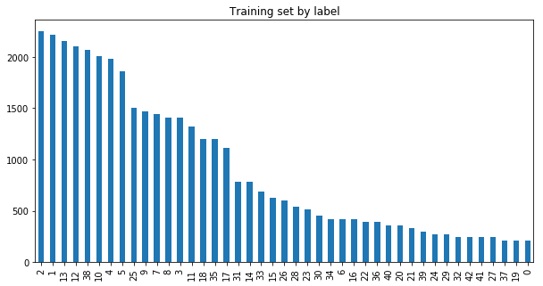

#**Traffic Sign Recognition** 

##Writeup Template

###You can use this file as a template for your writeup if you want to submit it as a markdown file, but feel free to use some other method and submit a pdf if you prefer.

---

**Build a Traffic Sign Recognition Project**

The goals / steps of this project are the following:
* Load the data set (see below for links to the project data set)
* Explore, summarize and visualize the data set
* Design, train and test a model architecture
* Use the model to make predictions on new images
* Analyze the softmax probabilities of the new images
* Summarize the results with a written report

[//]: # (Image References)

[image1]: ./examples/visualization.jpg "Visualization"
[image2]: ./examples/grayscale.jpg "Grayscaling"
[image3]: ./examples/random_noise.jpg "Random Noise"
[image4]: ./examples/placeholder.png "Traffic Sign 1"
[image5]: ./examples/placeholder.png "Traffic Sign 2"
[image6]: ./examples/placeholder.png "Traffic Sign 3"
[image7]: ./examples/placeholder.png "Traffic Sign 4"
[image8]: ./examples/placeholder.png "Traffic Sign 5"

## Rubric Points
###Here I will consider the [rubric points](https://review.udacity.com/#!/rubrics/481/view) individually and describe how I addressed each point in my implementation.  

---
###Writeup / README

####1. Provide a Writeup / README that includes all the rubric points and how you addressed each one. You can submit your writeup as markdown or pdf. You can use this template as a guide for writing the report. The submission includes the project code.

You're reading it! and code is included in this directory

###Data Set Summary & Exploration

####1. Provide a basic summary of the data set and identify where in your code the summary was done. In the code, the analysis should be done using python, numpy and/or pandas methods rather than hardcoding results manually.

The code for this step is contained in code cell 2 of the IPython notebook.  

I used the matplotlib and pandas library to calculate summary statistics of the traffic
signs data set:

* The size of training set is ?
* The size of test set is ?
* The shape of a traffic sign image is ?
* The number of unique classes/labels in the data set is ?

The output is as follows:

Number of training examples = 39209
Number of testing examples = 12630
Image data shape = (32, 32, 3)
Number of classes = 43

####2. Include an exploratory visualization of the dataset and identify where the code is in your code file.

The code for this step is contained in code cell 3 & 4 of the IPython notebook.  

Here is an exploratory visualization of the data set. First, showing a random selection of 10 images

These are 2 bar charts showing how the images are distributed ...

for the training set

for the testing set

###Design and Test a Model Architecture

####1. Describe how, and identify where in your code, you preprocessed the image data. What tecniques were chosen and why did you choose these techniques? Consider including images showing the output of each preprocessing technique. Pre-processing refers to techniques such as converting to grayscale, normalization, etc.

The code for this step is contained in code cell 5 of the IPython notebook.

As a first step, I decided NOT to convert the images to grayscale because I wanted to test the training network in color since it can accept a 3 color (rgb) 32x32x3 matrix

As a second step, I normalized the image data to reduce the range of values processed

####2. Describe how, and identify where in your code, you set up training, validation and testing data. How much data was in each set? Explain what techniques were used to split the data into these sets. (OPTIONAL: As described in the "Stand Out Suggestions" part of the rubric, if you generated additional data for training, describe why you decided to generate additional data, how you generated the data, identify where in your code, and provide example images of the additional data)

The code for splitting the data into training and validation sets is contained in code cell 5 of the IPython notebook.  

I tried splitting the set into 1/3 validation and 2/3 training, which yielded better results for this dataset

After pre processing shape of training, validation and test dataset are as follows:
(26270, 32, 32, 3) (12939, 32, 32, 3) (12630, 32, 32, 3)
The 32,32,3 show the image data in rgb format hence 32x32x3.

####3. Describe, and identify where in your code, what your final model architecture looks like including model type, layers, layer sizes, connectivity, etc.) Consider including a diagram and/or table describing the final model.

The code for my final model is located in cell 6 of the ipython notebook. 

My final model consisted of the following layers:

    **#Layer 1: Convolutional. Input = 32x32x1. Output = 28x28x6.**
    # Activation 1.
    # Pooling. Input = 28x28x6. Output = 14x14x6.

    
    **# Layer 2: Convolutional. Output = 10x10x16**.
    # Activation 2
    # Pooling. Input = 10x10x16. Output = 5x5x16.

    # Flatten. Input = 5x5x16. Output = 400.

    **# Layer 3: Fully Connected. Input = 400. Output = 120.**
    # Activation 3 
   

    **# Layer 4: Fully Connected. Input = 120. Output = 84. **
    # Activation 4 
    

    **# Layer 5: Fully Connected. Input = 84. Output = 10.**

####4. Describe how, and identify where in your code, you trained your model. The discussion can include the type of optimizer, the batch size, number of epochs and any hyperparameters such as learning rate.

The code for training the model is located in cell 7 of the ipython notebook. 

To train the model, I used the LEnet Architecture with mu = 0 and sigma = 0.1, with EPOCHS = 20, and BATCH_SIZE = 128

I initially tested it on MNIST numbers 0-9, which seems to work well, before trying it on traffic signs.

The reason for lesser EPOCHS and small batch size, was due to the fact that I did not have access to a GPU.

####5. Describe the approach taken for finding a solution. Include in the discussion the results on the training, validation and test sets and where in the code these were calculated. Your approach may have been an iterative process, in which case, outline the steps you took to get to the final solution and why you chose those steps. Perhaps your solution involved an already well known implementation or architecture. In this case, discuss why you think the architecture is suitable for the current problem.

The code for calculating the accuracy of the model is located in the ninth cell of the Ipython notebook.

My final model results were:
* validation set accuracy of Validation accuracy = 0.985
 
* test set accuracy of 0.909

LEnet is the basic solution for processing images 32x32, I believe that for small images, one should try it first.

I did not test with gray scale images due to timing and equipment constraints, however, since in real life situations, the color of traffics do matter. It's a good first test

The difference in the validation set and test set is significant and this is probably due to overfitting. To counter this, there are a few things to try:

1) dataset augmentation: Augment each label class by either skewing the data slightly between 5 or 15 degrees each way and saving the resulting images as new images within the label class. One can also apply different blurring filters to the images. The resulting new images then essentially "augments" the dataset.

2) shuffling the data set randomly and splitting the data set at different points or apply different percentage splits (eg 10/90,20/80 instead 0.332/0.67) 

###Test a Model on New Images

####1. Choose five German traffic signs found on the web and provide them in the report. For each image, discuss what quality or qualities might be difficult to classify.

Here are five German traffic signs that I found on the web:

The first image might be difficult to classify because when blurred or skewed the numbers "20" could look like "30" or even "80".

The second image might be difficult to classify because the resolution may not be enough to capture the wording on the sign 

The third image might be difficult to classify because the shadow across the sign could affect the reading of the words. In addition, the shadow's boundary may appear as a a feature.

The fourth image might be difficult to classify because of the low lighting and dark background

The fifth image might be difficult to classify because of blurriness

 
The sixth image might be difficult to classify because of the whitespace in the image which could be falsely predicted as a feature.

####2. Discuss the model's predictions on these new traffic signs and compare the results to predicting on the test set. Identify where in your code predictions were made. At a minimum, discuss what the predictions were, the accuracy on these new predictions, and compare the accuracy to the accuracy on the test set (OPTIONAL: Discuss the results in more detail as described in the "Stand Out Suggestions" part of the rubric).

The code for making predictions on my final model is located in cell 9 of the Ipython notebook.

Here are the results of the prediction:

| Image			        |     Prediction	        					| 
|:---------------------:|:---------------------------------------------:| 
| 20 km/h       		| 20 km/h  										| 
| Stop      			| Stop 											|
| Stop                  | Stop											|
| General Caution		| General Caution								|
| No Entry	      		| No Entry						 				|
| 20 km/h				| 20 km/h     									|

The model was able to correctly guess 5 of the 6 traffic signs, which gives an accuracy of 83.33%. This compares favorably to the accuracy on the test set BUT I would be cautious of the results due to the small sample size. However, the 100% result is consistent with the test set accuracy which should yield an accuracy of >90%. 5/6 is close to 90% +- 1/6. Thus 5/6 seems consistent. 

####3. Describe how certain the model is when predicting on each of the five new images by looking at the softmax probabilities for each prediction and identify where in your code softmax probabilities were outputted. Provide the top 5 softmax probabilities for each image along with the sign type of each probability. (OPTIONAL: as described in the "Stand Out Suggestions" part of the rubric, visualizations can also be provided such as bar charts)

The code for making predictions on my final model is located in cell 11 of the Ipython notebook. 

For the first 5 images, the model is relatively sure of it's accuracy (probability close to 1), however for the 6th image, there is whitespace surrounding the image. Thus the prediction was 89.97% but it still recorded inaccurately for this particular case. 

Again, skewness and whitespace could affect accuracy in image recognition.